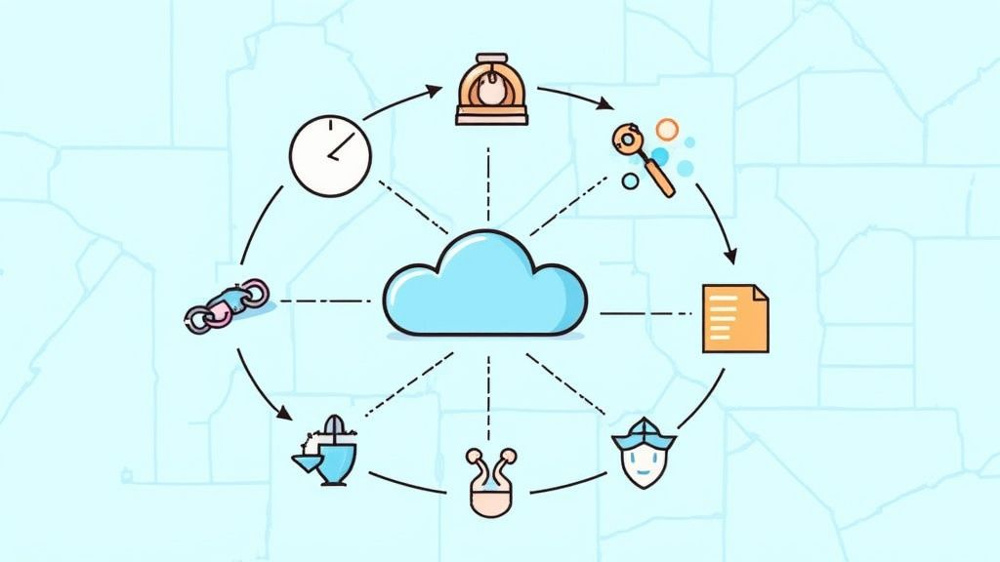
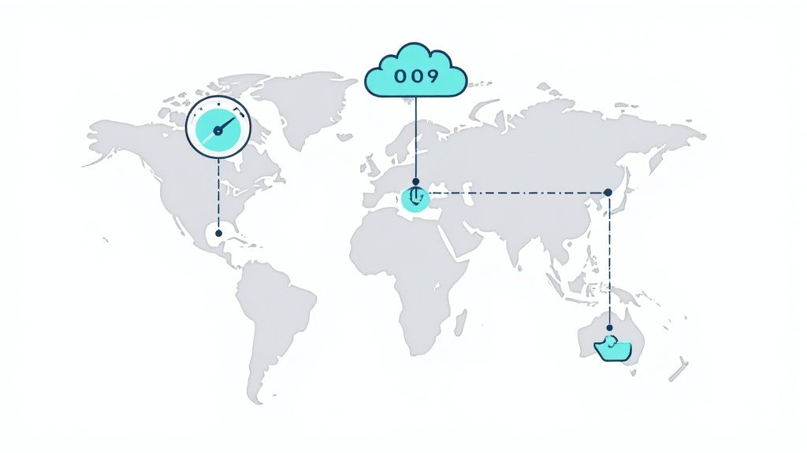

Moving to the cloud can unlock serious gains in scalability, efficiency, and speed of innovation. But the path is rarely linear. Projects can stall, budgets can drift, and security gaps appear if you treat migration like a simple “lift and shift.” Winning here means planning with intent, anticipating where things break, and aligning tech, people, and process from day one. Many teams underestimate the complexity and pay for it with delays and missed outcomes.

This guide breaks down the eight most pressing **cloud migration challenges** we're seeing in 2025 - and how to beat them. Expect practical strategies, real examples, and specific tools you can put to work now. Whether you're dealing with cost control, legacy constraints, or compliance, you'll walk away with a clear plan to get results.

You'll learn how to tackle:

* Data security and compliance
* Legacy application modernization
* Cost management and budget risk
* Vendor lock-in and multi-cloud complexity

Understand these upfront, and you'll build a migration roadmap that delivers value without surprises.

---

## 1. Data Security and Compliance Concerns

Security and compliance are non-negotiable. When you move sensitive data from on-prem to a third-party platform, you enter a shared responsibility model. Cloud providers secure the infrastructure; you secure your data, identities, and configurations. That means access control, encryption in transit and at rest, and clean configurations that pass audits for frameworks like GDPR, HIPAA, and PCI DSS. Miss here and you risk penalties, reputational damage, and trust - fast.

### Real-World Success

* **Capital One** moved core operations to AWS while staying inside PCI DSS guardrails.
* European banks are proving GDPR compliance can be done in the cloud with the right controls.

### What to Do

* **Run pre-migration audits.** Classify data, map regulatory scope, and baseline with tools like AWS Security Hub or Azure Security Center.
* **Adopt zero trust.** MFA everywhere, least privilege by default, and network segmentation.
* **Document as you go.** Configuration, access policies, and control mappings make audits painless.

---

## 2. Legacy Application Compatibility and Modernization

Legacy apps weren't built for distributed, cloud-native environments. Monoliths and hard dependencies don't magically scale, so you need a decision per workload: rehost as-is, refactor, re-platform, rebuild, replace, or retain. Skip this analysis and you'll inherit poor performance, surprise costs, and blocked cloud benefits.

<iframe width="560" height="315" src="https://www.youtube.com/embed/RJ3UQSxwGFY" frameborder="0" allow="accelerometer; autoplay; clipboard-write; encrypted-media; gyroscope; picture-in-picture" allowfullscreen></iframe>

### Real-World Success

* **GE** migrated \~9,000 apps to AWS, often using containers to package legacy code.
* **BMW Group** is moving core manufacturing systems to Azure to modernize decades-old processes.

### What to Do

* **Use the “6 R's.”** Rehost, Refactor, Revise, Rebuild, Replace, or Retain - apply per app.
* **Prioritize by business value.** Start with high-value, low-complexity wins.
* **Lean on containers.** Docker + Kubernetes buys portability without a full rewrite.
* **Assess first.** Use AWS Migration Hub or Azure Migrate for discovery, dependency mapping, and strategy recommendations.

---

## 3. Cost Management and Budget Overruns

Cloud ≠ automatically cheaper. You're moving from fixed CapEx to variable OpEx where small mistakes compound. Without FinOps discipline, idle dev stacks, oversized instances, and forgotten resources burn cash. Pricing models are flexible - but you have to manage them.

### Real-World Success

* **Spotify** cut AWS spend >25% with RIs/Savings Plans on predictable workloads.
* **Pinterest** saved millions by enforcing a cost culture: automated shutdowns and right-sizing.

### What to Do

* **Start with visibility.** Turn on AWS Cost Explorer or Azure Cost Management on day one.
* **Commit where predictable.** Use RIs/Savings Plans for steady compute (discounts can be significant).
* **Automate guardrails.** Budgets, alerts, and policies that kill zombie resources before they bill.

---

## 4. Network Connectivity and Performance Issues

Your network becomes the nervous system of a hybrid or cloud environment. If bandwidth, latency, or reliability are shaky, user experience and data sync will be too. Public internet might be fine for testing; production needs more.

### Real-World Success

* **Goldman Sachs** uses AWS Direct Connect for predictable, low-latency trading workloads.
* **Zoom** engineered its global network across regions to absorb traffic spikes.
* **Salesforce** relies heavily on CDNs to cut latency worldwide.

### What to Do

* **Assess traffic early.** Measure bandwidth and latency to candidate regions before you move.
* **Use private links for critical paths.** AWS Direct Connect, Azure ExpressRoute, or GCP Interconnect.
* **Adopt a CDN.** CloudFront, Cloudflare, etc., to place content close to users.

---

## 5. Vendor Lock-in and Multi-cloud Strategy

Native services are powerful and fast to ship - but the tighter you couple to one provider's proprietary stack, the harder exit becomes. Lock-in reduces your leverage and options later.

### Real-World Success

* **Dropbox** famously left AWS for custom infra - hard, but possible.
* Many enterprises choose multi-cloud from day one. Kubernetes is the standard layer that travels.

### What to Do

* **Design for portability.** Containers + microservices on Kubernetes decouple apps from infra.
* **Prefer open standards.** Pick PostgreSQL/MySQL over provider-specific databases when portability matters.
* **Use IaC that spans clouds.** Terraform lets you define once and provision anywhere.

---

## 6. Skills Gap and Change Management

Cloud isn't just new tech - it's a new operating model. You need cloud fluency across Dev, Ops, Security, and Finance. Without upskilling and a plan for cultural change, migrations drag and costs rise.

### Real-World Success

* **Microsoft** trained 140k+ employees on Azure for its own transformation.
* **GE** invested heavily to build internal cloud talent.

### What to Do

* **Stand up a Cloud Center of Excellence (CCoE).** Central experts, common patterns, shared governance.
* **Train early, not after go-live.** AWS Training and Certification or Microsoft Learn can structure paths.
* **Push DevOps practices.** Collaboration, automation, and shared ownership unlock cloud speed.

---

## 7. Data Migration and Integrity Challenges

Moving large datasets is risky and slow if you don't plan it well. You have to maintain integrity, minimize downtime, and keep systems consistent across formats and platforms. Even small errors can corrupt or desync data and force restarts.

### Real-World Success

* **Netflix** migrated petabytes to AWS over years using a phased approach.
* **Pinterest** moved its data warehouse with minimal BI downtime by leaning on cloud-native tooling.

### What to Do

* **Use native migration services.** AWS DMS or Azure Database Migration Service handle replication and schema work.
* **Validate aggressively.** Checksums and hash comparisons at each stage.
* **Migrate in phases.** Start with non-critical datasets, learn, then scale.

---

## 8. Governance, Risk, and Compliance Management

Cloud dissolves traditional perimeters. Your governance model has to evolve with it. Without clear policies, automation, and continuous monitoring, you'll overspend, miss controls, or drift out of compliance.

### Real-World Success

* **JPMorgan Chase** built automated cloud controls to maintain financial compliance.
* **Johnson & Johnson** established a governance model that meets strict GxP expectations.

### What to Do

* **Write cloud-specific policies.** Tagging, access control, cost management, baseline security configs.
* **Automate compliance.** Use Azure Policy or AWS Organizations-style guardrails for continuous enforcement.
* **Centralize enablement with a CCoE.** Patterns, templates, and guidance keep adoption consistent.

---

## Cloud Migration Challenges Comparison

| Challenge                                | Implementation Complexity                     | Resource Requirements              | Expected Outcomes                               | Ideal Use Cases                      | Key Advantages                                  |
| ---------------------------------------- | --------------------------------------------- | ---------------------------------- | ----------------------------------------------- | ------------------------------------ | ----------------------------------------------- |
| Data Security and Compliance Concerns    | High: multi-layer encryption, IAM, compliance | Security experts, compliance tools | Strong security posture, regulatory adherence   | Sensitive data, regulated industries | Advanced security features, centralized control |
| Legacy App Compatibility & Modernization | Very High: refactor, re-platform, rebuild     | Dev teams, assessment tools        | Modernized apps, better scale, less maintenance | Legacy to cloud                      | Modernization potential, scalability            |
| Cost Management & Budget Overruns        | Medium: pricing models, monitoring            | FinOps analysts, cost tools        | Controlled spend, optimized usage               | Budget-sensitive migrations          | Pay-as-you-go flexibility, analytics            |
| Network Connectivity & Performance       | Medium–High: setup, latency tuning            | Network engineers, monitoring      | Reliable, low-latency connectivity              | Hybrid, latency-sensitive apps       | Global infra, advanced networking               |
| Vendor Lock-in & Multi-cloud             | Medium: portable architecture                 | Architects, multi-cloud tooling    | Reduced single-vendor risk                      | Multi-cloud adoption                 | Ecosystem access, leverage                      |
| Skills Gap & Change Mgmt                 | Medium: training, culture                     | Training resources, change leads   | Cloud-fluent teams, smoother adoption           | Scale cloud usage                    | Modern practices, faster delivery               |
| Data Migration & Integrity               | High: volume, validation, downtime            | Migration tools, data experts      | Integrity preserved, minimal downtime           | Large datasets                       | Accessibility, reliable backups                 |
| Governance, Risk & Compliance            | High: policy + automation                     | Governance tools, compliance teams | Automated compliance, centralized control       | Regulated/hybrid                     | Visibility, policy-as-code                      |

---

## From Challenge to Opportunity: Charting Your Course

Cloud migration isn't a one-and-done project - it's the start of a cycle: optimize, govern, refine. Teams that plan proactively, modernize intentionally, practice FinOps, and invest in people don't just land in the cloud - they thrive there.

**Bottom line:**

* Build security in from the first planning doc.
* Modernize where it matters instead of defaulting to lift-and-shift.
* Make costs visible and governed.
* Train your people and lead the culture change.

Do that, and you'll unlock agility, scale on demand, and a platform ready for AI and whatever comes next.

**If you want a hands-on partner to accelerate this, *Pratt Solutions* guides teams through complex migrations on AWS, Azure, and GCP - and leaves them better equipped to run day-to-day. [Get in touch](https://john-pratt.com/#contact) to discuss your Cloud, DevOps, & Infrastructure needs.**