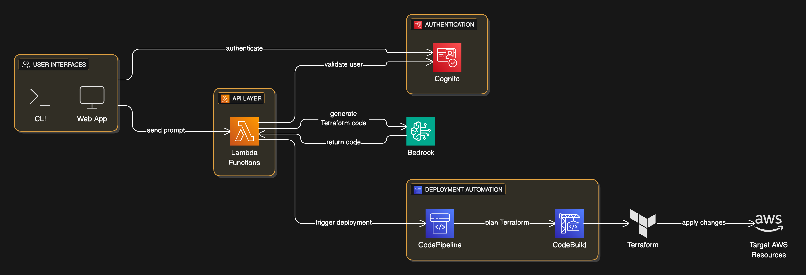

**Author:** John Pratt, AWS Solutions Architect Professional

---

**Intro**

When we initially thought of TALOS (**T**erraform-**A**I **L**anguage **O**rchestration **S**ystem), our mandate was clear: empower enterprise-scale teams to treat cloud infrastructure as fluid, self-service code. Rather than wrestle with verbose Terraform modules or wait on central DevOps queues, developers and architects alike should be able to describe desired resources in plain English- whether via a CLI or a lightweight web console- and see compliant Terraform manifests generated and deployed automatically. TALOS bridges that gap by combining AWS Bedrock's generative AI, a secure auth layer with Cognito, and a fully automated CI/CD back end, delivering a frictionless “natural-language → infrastructure” workflow .

---

**Problem**

Implementing TALOS meant tackling three core challenges:

1. **Language Understanding at Scale**
   Translating free-form prompts like “Provision a VPC with three public subnets across AZs” into idempotent, secure Terraform code demanded rigorous prompt engineering- and a tightly controlled module library to prevent drift or insecure patterns.

2. **Enterprise-Grade Security**
   Exposing AI-driven IaC generation to end users raised red flags around authentication, authorization, and auditability. We needed a zero-trust approach where every request is validated, every code snippet is traceable, and no one could bypass guardrails.

3. **Seamless Deployment Automation**
   Piping generated code into a pipeline without manual intervention required orchestrating CodePipeline and CodeBuild to plan, review, and apply Terraform changes against production-scale AWS accounts- with deterministic rollbacks on failure.

---

**Solution**

The final TALOS architecture (see `talos.png`) looks like this:

* **User Interfaces:** A Node.js CLI and a React web app front end, both authenticating against Amazon Cognito.
* **API Layer:** AWS Lambda functions receive prompts, validate  incoming JWTs via Cognito, and forward structured requests to AWS Bedrock.
* **AI Engine:** Bedrock returns Terraform HCL snippets drawn from our audited module repository. Lambdas then trigger `CodePipeline`.
* **Deployment Automation:** CodePipeline executes Terraform `plan` in CodeBuild, surfaces diffs for optional review, then runs `apply` to provision or modify resources. All state is stored in an S3-backed Terraform backend, with locks via DynamoDB.

In practice, a developer types `talos create-environment “prod us-east-1 k8s cluster with breach detection”` and, within minutes, a new EKS cluster appears - fully compliant with configured security standards.

---

**Why TALOS?**

* Natural-language-driven IaC accelerates cloud adoption by collapsing request-to-deployment cycles from days to minutes.

* Without strict guardrails, AI-generated code can introduce misconfigurations, security gaps, or unintended dependencies. Drift between modules and prompts must be continuously reconciled.

* In my experience, you should start by scoping prompts to a well-defined domain (e.g., networking or compute). Invest early in a hardened module catalog and incorporate semantic tests (e.g., Sentinel or custom policy checks). Layer in human-in-the-loop reviews only for high-impact changes, and leverage Cognito groups to segment access by role.

---

**Conclusion**

By implementing TALOS, we've empowered our enterprise clients to:

* **Accelerate Delivery:** Slash infrastructure provisioning times from days of ticketing and handoffs to sub-hour pipelines.
* **Enforce Compliance:** Embed security and governance into each prompt, eliminating configuration drift.
* **Boost Developer Autonomy:** Reduce busywork for platform teams and let engineers iterate on environments with confidence.

The result is a harmonious balance of speed, security, and scale- exactly what modern enterprises demand.

**Interested in learning more or giving TALOS a try? [Get in touch](https://john-pratt.com/#contact) to discuss your Cloud, DevOps, & Infrastructure needs.**